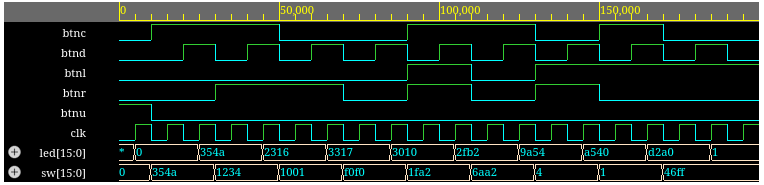
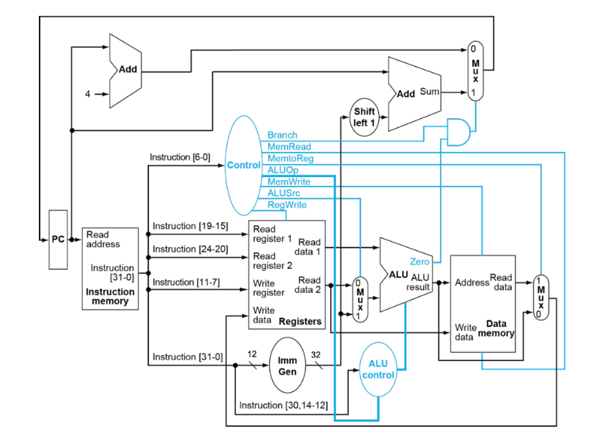
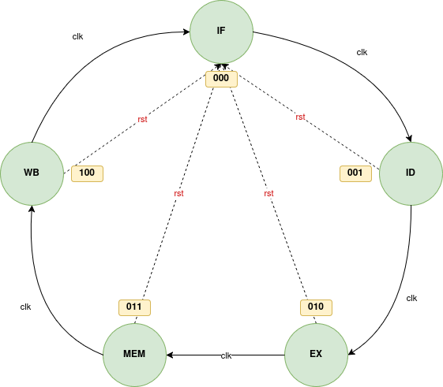
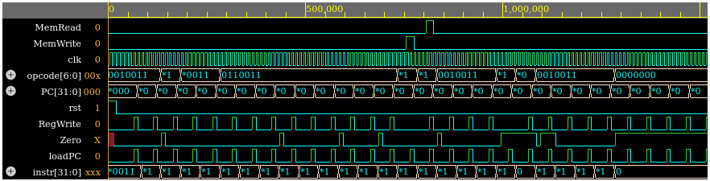

# HARDWARE-1: Αναφορά Εργασίας

Αυτή η αναφορά περιλαμβάνει την περιγραφή και υλοποίηση των ασκήσεων που ανατέθηκαν στο πλαίσιο του μαθήματος `HARDWARE-1`. Κάθε άσκηση συνοδεύεται από ανάλυση του κώδικα, διαγράμματα και αποτελέσματα προσομοιώσεων.

- **Άσκηση 1**: Υλοποίηση του module `alu` για αριθμητικές και λογικές πράξεις.
- **Άσκηση 2**: Δημιουργία αριθμομηχανής με χρήση της `ALU` και συνδυαστικής λογικής.
- **Άσκηση 3**: Υλοποίηση μονάδας καταχωρητών (`regfile`).
- **Άσκηση 4**: Σχεδίαση και υλοποίηση του `datapath` για βασικές εντολές RISC-V.
- **Άσκηση 5**: Υλοποίηση του `top_proc` με FSM και δοκιμές εντολών RISC-V.

Η αναφορά περιλαμβάνει επίσης διαγράμματα, waveforms και πίνακες που τεκμηριώνουν τη λειτουργία των υλοποιήσεων.

## Άσκηση 1 : `alu.v`

Σε αυτήν την άσκηση υλοποιήθηκε ένα module `alu`, το οποίο πραγματοποιεί διάφορες αριθμητικές και λογικές πράξεις. Οι διαφορετικές λειτουργίες της μονάδας ορίστηκαν ως παράμετροι, όπως φαίνεται παρακάτω:

```verilog
parameter[3:0] ALUOP_AND = 4'b0000;
parameter[3:0] ALUOP_OR = 4'b0001;
parameter[3:0] ALUOP_ADD = 4'b0010;
parameter[3:0] ALUOP_SUB = 4'b0110;
parameter[3:0] ALUOP_LESS = 4'b0100;
parameter[3:0] ALUOP_LOG_SHIFT_R = 4'b1000;
parameter[3:0] ALUOP_LOG_SHIFT_L = 4'b1001;
parameter[3:0] ALUOP_ARI_SHIFT_R = 4'b1010;
parameter[3:0] ALUOP_XOR = 4'b0101;
```

Η υλοποίηση των πράξεων έγινε μέσα σε ένα `always` block, χρησιμοποιώντας την εντολή `case` για την επιλογή της κατάλληλης πράξης, με βάση το σήμα ελέγχου `alu_op`.

## Άσκηση 2

Σε αυτήν την άσκηση, υλοποιήθηκαν τα παρακάτω αρχεία: `calc.v`, `calc_enc.v`, και `tb_calc.v`.

### `calc_enc.v`

Το αρχείο `calc_enc.v` περιέχει τη συνδυαστική λογική που παράγει το σήμα `alu_op`. Το σήμα αυτό είναι 4-bit που καθορίζει τη λειτουργία της μονάδας `ALU`, με βάση τις εισόδους `btnc`, `btnr`, και `btnl`.

Η σχεδίαση βασίστηκε στη χρήση πυλών `AND`, `OR` και `NOT`. Κάθε bit του `alu_op` υπολογίζεται μέσω συγκεκριμένων συνδυασμών των εισόδων.

### `calc.v`

Στο αρχείο `calc.v` υλοποιείται μια αριθμομηχανή, η οποία ενσωματώνει τις λειτουργίες της μονάδας `ALU` και της λογικής κωδικοποίησης από το `calc_enc.v`.  Η αριθμομηχανή δέχεται ως εισόδους διάφορα πλήκτρα (buttons), διακόπτες για την
εισαγωγή δεδομένων `sw`, και το ρολόι (`clk`), ενώ παρέχει ως έξοδο το σήμα `led`.

#### Βασική Υλοποίηση

- **Δημιουργία Instances**:
  - `alu` για αριθμητικές και λογικές πράξεις.
  - `calc_enc.v` για τον προσδιορισμό του `alu_op`.
- **Είσοδοι και Σήματα**:
  - `signal_op1` και `signal_op2` αντιστοιχίζονται στον `accumulator` και τους διακόπτες `sw`.
  - Το `led` εμφανίζει την τρέχουσα τιμή του `accumulator`.
- **Λογική Λειτουργία**:
  - Το `accumulator` ανανεώνεται σε `always` block στην ακμή του `clk`.
  - Αν `btnu` πατηθεί, το `accumulator` μηδενίζεται.
  - Αν `btnd` πατηθεί, το αποτέλεσμα της `ALU` αποθηκεύεται στο `accumulator`.

### `tb_calc.v`

Το αρχείο `tb_calc.v` αποτελεί το testbench της αριθμομηχανής που υλοποιείται στο `calc.v`. . Σε αυτό, δημιουργήθηκαν δύο tasks για να διευκολύνουν τη δοκιμή διαφορετικών λειτουργιών της αριθμομηχανής. Όλες οι τιμές που προέκυψαν από τις δοκιμές ήταν οι αναμενόμενες.

#### Task: `perform_operation`

Εκτελεί μια πράξη στην αριθμομηχανή με είσοδο:

- `buttons`: Καταστάσεις των κουμπιών (`btnc`, `btnr`, `btnl`).
- `switch_value`: Τιμή που παρέχεται μέσω του διακόπτη (`sw`).

#### Task: `display_result`

Εμφανίζει το αποτέλεσμα της αριθμομηχανής και το συγκρίνει με την αναμενόμενη τιμή. Παίρνει ως είσοδο την αναμενόμενη τιμή της εξόδου `led`.

Εκτελεί τα εξής:
- Συγκρίνει την έξοδο `led` με την αναμενόμενη τιμή.
- Εμφανίζει μήνυμα επιτυχίας `PASS` αν η τιμή είναι σωστή, ή αποτυχίας `FAIL` αν δεν είναι.

Ο λόγος για τη δημιουργία αυτού του task είναι η απλοποίηση της εκτέλεσης των πράξεων. Αντί να επαναλαμβάνονται χειροκίνητα τα βήματα σε κάθε δοκιμή, το task τα συγκεντρώνει σε μια επαναχρησιμοποιήσιμη μορφή.

### Αποτελέσματα

Δοκιμάστηκαν διάφορες λειτουργίες της αριθμομηχανής, όπως η πρόσθεση, αφαίρεση, λογικές πράξεις (`AND`, `OR`, `XOR`), μετατοπίσεις (λογικές και αριθμητικές), καθώς και η σύγκριση (`Less Than`). Όλες οι τιμές που προέκυψαν από τις δοκιμές ήταν οι αναμενόμενες, επιβεβαιώνοντας τη σωστή λειτουργία του σχεδιασμού.

### Εικόνα Εξόδου (Waveform)
Παρατίθεται η εικόνα της παραγόμενης waveform για την προσομοίωση που πραγματοποιήθηκε κατά τη διάρκεια των δοκιμών.



## Άσκηση 3: `regfile.v`

Το αρχείο `regfile.v` υλοποιεί τη μονάδα των καταχωρητών για το σύστημα. Στη συγκεκριμένη υλοποίηση, χρησιμοποιείται ένα `always` block το οποίο δίνει προτεραιότητα στην εγγραφή του σήματος `writeData` στους καταχωρητές.

Η λογική του `always` block περιλαμβάνει τα εξής βήματα:

- Όταν ενεργοποιείται το `write` (δηλαδή όταν υπάρχει αίτημα εγγραφής), το σύστημα εγγράφει το `writeData` στον καταχωρητή που υποδεικνύεται από το `writeReg`.
- Στη συνέχεια, τα δεδομένα που διαβάζονται από τους καταχωρητές (όπως προσδιορίζεται από τα σήματα `readReg1` και `readReg2`) ανατίθενται στις μεταβλητές `readData1` και `readData2`.
- Το σύστημα εξασφαλίζει ότι αν η εγγραφή αφορά τον ίδιο καταχωρητή που διαβάζεται (π.χ. όταν `writeReg == readReg1` ή `writeReg == readReg2`), το `writeData` δίνεται προτεραιότητα και η αντίστοιχη έξοδος `readData1` ή `readData2` ενημερώνεται άμεσα με την εγγραφή.

Η λογική αυτή διασφαλίζει ότι οι καταχωρητές επιστρέφουν την πιο πρόσφατη τιμή, ακόμα και αν η εγγραφή γίνεται την ίδια στιγμή με την ανάγνωση.

## Άσκηση 4: `datapath.v`

Στην Άσκηση 4, υλοποιήθηκε το αρχείο `datapath.v`, το οποίο διαχειρίζεται τις βασικές εντολές του επεξεργαστή RISC-V. Πρώτα βρέθηκαν τα opcodes για κάθε εντολή:

```verilog
localparam [6:0] LW = 7'b0000011;
localparam [6:0] SW = 7'b0100011;
localparam [6:0] BEQ = 7'b1100011;
localparam [6:0] IMMEDIATE = 7'b0010011;
```

Στη συνέχεια, υλοποιήθηκε ο μηχανισμός Instruction Decode, ο οποίος επεξεργάζεται την εντολή που δίνεται ως είσοδος. Ο μηχανισμός αυτός εξάγει τα απαραίτητα πεδία της εντολής, όπως τα `rs1`, `rs2`, και `rd`, καθώς και το `opcode`.

```verilog
reg [4:0] rs1, rs2, rd;
reg [6:0] opcode;
always @(*) begin
    opcode = instr[6:0];
    rs1 = instr[19:15];
    rs2 = instr[24:20];
    rd = instr[11:7];
end
```

Στην υλοποίηση, προστέθηκαν instances για την `ALU` και τους καταχωρητές (`regfile`). Επιπλέον, τα σήματα που αναφέρθηκαν στην εκφώνηση της άσκησης ρυθμίστηκαν σύμφωνα με το παρακάτω διάγραμμα:

### Διάγραμμα για την υλοποίηση του datapath


## Άσκηση 5: `top_proc.v`

Στην τελευταία άσκηση, χρειάστηκαν κωδικοποιήσεις για πολλές εντολές του RISC-V. Βασισμένο σε αυτά, υλοποιήθηκε το `ALUCtrl`, το οποίο ελέγχει τις εντολές για να καθορίσει ποια πράξη πρέπει να εκτελέσει η ALU. 

Στη συνέχεια, δημιουργήθηκε ένα FSM (Finite State Machine) για τη διαχείριση των καταστάσεων του επεξεργαστή.


### FSM States

```verilog
IF: begin
    loadPC <= 0;
    MemRead <= 0;
    MemWrite <= 0;
    RegWrite <= 0;
    MemToReg <= 0;
end
ID:; // Instruction Decode
EX:; // Execute
MEM: begin
    if (opcode == LW)
        MemRead  <= 1;
    else if (opcode == SW)
        MemWrite <= 1;
end
WB: begin
    loadPC <= 1;
    if (opcode == LW)
        MemToReg <= 1;
    if (opcode != SW && opcode != BEQ)
        RegWrite <= 1;
end
```

### Διάγραμμα FSM



### `top_proc_tb.v`

### Δοκιμή του `top_proc.v`

Για τη δοκιμή του `top_proc.v`, υλοποιήθηκε testbench που περιλαμβάνει το `top_proc`, τη μνήμη εντολών (ROM), και τη μνήμη δεδομένων (RAM), οι οποίες παρέχονται. Το testbench αρχικοποιεί το ρολόι και το σήμα reset, επιτρέποντας στον μετρητή προγράμματος (PC) να προχωρά μέσα από τις εντολές που είναι αποθηκευμένες στη ROM. 

Η προσομοίωση τρέχει για επαρκή χρόνο (1500ns) ώστε να εκτελεστούν όλες οι εντολές. Για να καταγράφεται η τρέχουσα εντολή (`instr`), χρησιμοποιήθηκε η εντολή `$monitor`. Οι καταγεγραμμένες εντολές αποκωδικοποιήθηκαν χρησιμοποιώντας το εργαλείο [RVCodec](https://luplab.gitlab.io/rvcodecjs/).

| **Binary Code**           | **Instruction**         |
|----------------------------|-------------------------|
| 00000000011100000000000010010011 | `addi x1, x0, 7`       |
| 00000001010100000000000100010011 | `addi x2, x0, 21`      |
| 00000000001000001000000110110011 | `add x3, x1, x2`       |
| 11111111011100000000001000010011 | `addi x4, x0, -9`      |
| 11111110111100010000001010010011 | `addi x5, x2, -17`     |
| 00000000010000101000001100110011 | `add x6, x5, x4`       |
| 01000000001000011000001110110011 | `sub x7, x3, x2`       |
| 00000000010100111001010000110011 | `sll x8, x7, x5`       |
| 00000000100000100010010010110011 | `slt x9, x4, x8`       |
| 00000000001001000100010100110011 | `xor x10, x8, x2`      |
| 00000000100001010111010110110011 | `and x11, x10, x8`     |
| 00000000100101011101011000110011 | `srl x12, x11, x9`     |
| 00000000001101100110011010110011 | `or x13, x12, x3`      |
| 01000000100100100101011100110011 | `sra x14, x4, x9`      |
| 00000000101100101010000000100011 | `sw x11, 0(x5)`        |
| 00000000000000101010011110000011 | `lw x15, 0(x5)`        |
| 11111101001101000111100000010011 | `andi x16, x8, -45`    |
| 00000001011010000110100010010011 | `ori x17, x16, 22`     |
| 00000000000101101101100100010011 | `srli x18, x13, 1`     |
| 00000000101101111000100001100011 | `beq x15, x11, 16`     |
| 00000000111110010010010010010011 | `slti x9, x18, 15`     |
| 00000011101001000100100110010011 | `xori x19, x8, 58`     |
| 00000000000110001001101000010011 | `slli x20, x17, 1`     |
| 01000000001001111101001010010011 | `srai x5, x15, 2`      |

### Αποτέλεσμα της προσωμοίωσης (Waveform)


